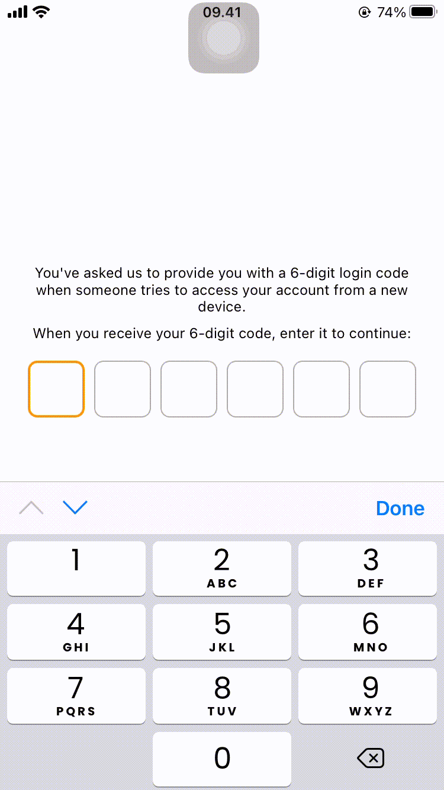
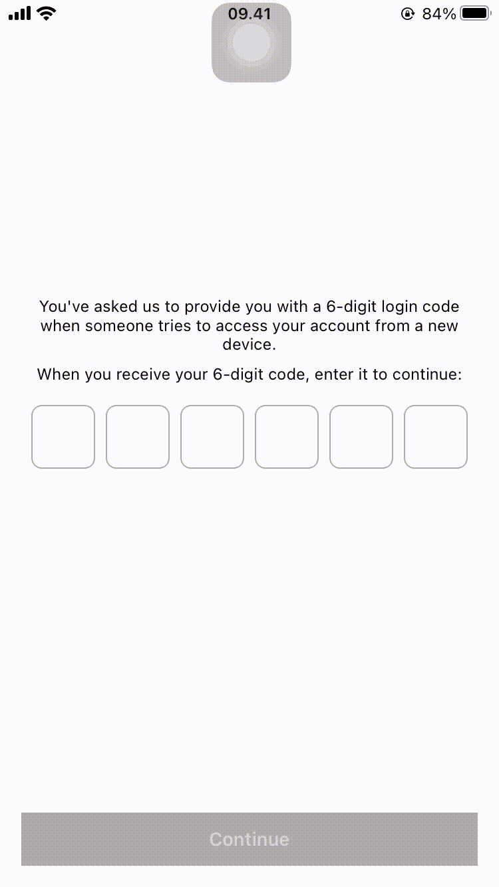

# OTPStackView
Customizable UIStackView that consists of custom UITextFields for OTP or Security code with AutoFill support.

<p align="center" width="100%">
    
    
</p>

## Supported OS & SDK Versions
- Supported build target - iOS 10.0+ (Xcode 10.3+)

## Installation
### Cocoapods
To install OTPStackView, simply add the following line to your Podfile:
```
pod 'OTPStackView', 
  :git => 'https://github.com/intan1907/OTPStackView.git', 
  :tag => '1.0.2'
```
### Manually
If you prefer not to use Cocoapods, you can integrate OTPStackView into your project manually.

## Usage
1. First, import the library.
    ```swift
    import OTPStackView
    ```
2. Create the `OTPStackView`, specify your `numberOfFields` value.
    ```swift
    let otpView = OTPStackView(numberOfFields: 6, delegate: self)
    view.addSubview(otpView)
    ```
3. Then setup the `OTPDelegate` method. Parameter `isValid` determines whether the OTP fields are filled.
    ```swift
    extension ViewController: OTPDelegate {
        func didChangeValidity(isValid: Bool) {
            // ...
        }
    }
    ```
4. To get the OTP string, use `getOTP()` method.
    ```swift
    let otpString = otpView.getOTP()
    ```

## Customization
Before going to how to customize the `OTPStackView`, you have to know that `OTPStackView` is a subclass of `UIStackView` that contains a number of `OTPTextField`s which is the `UITextField` subclass. Therefore, attributes that you can customize in OTPStackView are in general UIStackView's attributes. Other than that, you can customize the number of textFields from `numberOfFields` attribute.

```swift
OTPStackView(
    numberOfFields: Int = 4,
    textFieldPreferences: OTPTextField.Preferences = OTPTextField.Preferences(),
    spacing: CGFloat = 8,
    delegate: OTPDelegate?
)
```

In order to customize `OTPTextField` appearance and behavior, you can play with the `Preferences` structure which encapsulates all the customizable properties of the `OTPTextField`. These preferences have been split into two structures:
1. `Drawing` - encapsulates customizable properties specifying how `OTPTextField` will be drawn on screen.
2. `TextInputTraits` - encapsultes customizable properties specifying features for keyboard input to `OTPTextField`.

| `Drawing` Attribute  | Description           |
|----------------------|-----------------------|
| `backgroundColor`    | The background color of `OTPTextField` (default `UIColor.white`).
| `textColor`          | The text color of `OTPTextField` (default `UIColor.black`).
| `cornerRadius`       | The corner radius of `OTPTextField` (default 8).
| `width`              | The width of `OTPTextField` (default `nil`). **The height of `OTPTextField` is equal to `OTPStackView`'s height. But you can customize the width otherwise it's also equal to `OTPStackView`'s height.**
| `inactiveBorderWidth`| The border width of `OTPTextField` when it's in the normal state (default 1).
| `inactiveBorderColor`| The border color of `OTPTextField` when it's in the normal state (default `UIColor.lightGray`).
| `activeBorderWidth`  | The border width of `OTPTextField` when it's in the editing state (default 2).
| `activeBorderColor`  | The border color of `OTPTextField` when it's in the editing state (default `UIColor.cyan`).

| `TextInputTraits` Attribute  | Description           |
|------------------------------|-----------------------|
| `font`                       | The font of `OTPTextField` (default `UIFont.systemFont(ofSize: 16)`).
| `textAlignment`              | The technique for aligning the `OTPTextField`'s text (default `NSTextAlignment.center`).
| `adjustsFontSizeToFitWidth`  | A Boolean value that determines whether the `OTPTextField` reduces the text’s font size to fit the title string into the `OTPTextField`’s bounding rectangle (default `false`).
| `keyboardType`               | The type of keyboard to display as `OTPTextField`'s input view (default `UIKeyboardType.numberPad`).
| `autocorrectionType`         | The autocorrection style for `OTPTextField` (default `UITextAutocorrectionType.yes`).